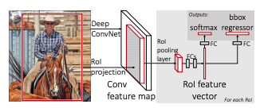
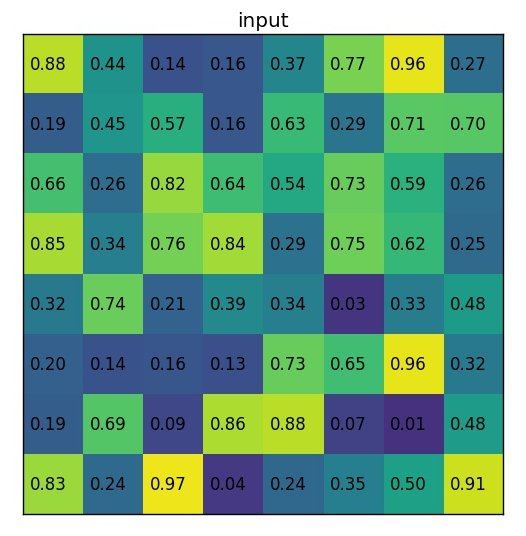
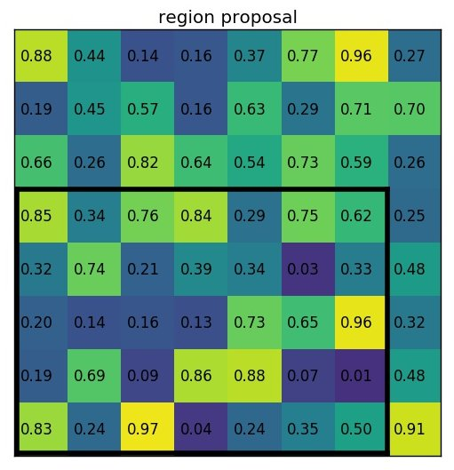
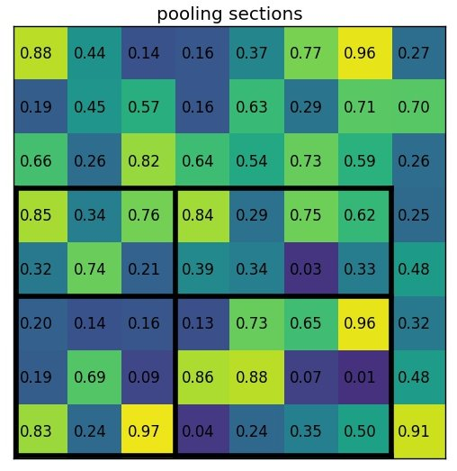
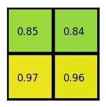
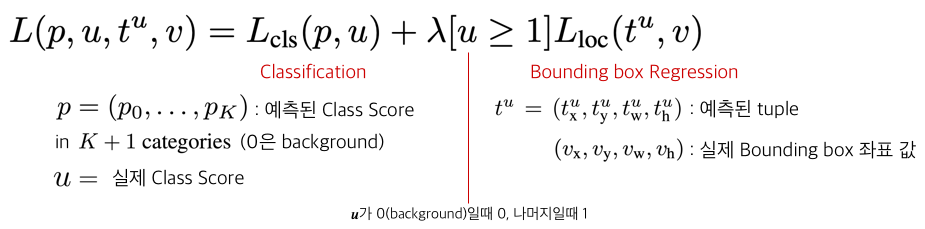
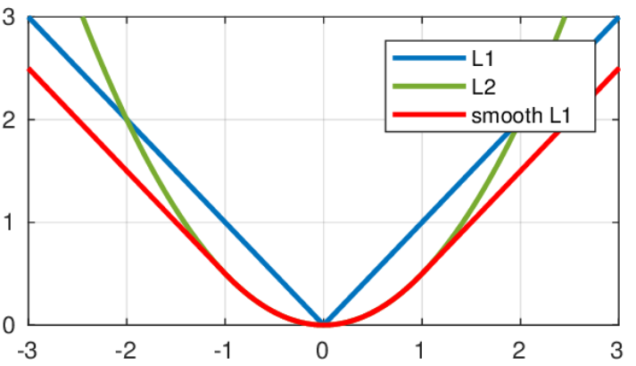
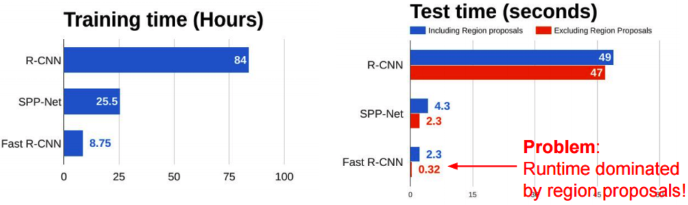

# Fast R-CNN

이정수

인공지능 오픈랩 팀 IEEE

### [2015 IEEE International Conference on Computer Vision (ICCV)](https://ieeexplore.ieee.org/xpl/conhome/7407725/proceeding)

- SPP Net에서 R-CNN에 비해 비약적인 발전이 이루어졌지만 여전히 여러가지 문제점이 있음

  * end-to-end가 아닌 여러 단계의 학습이 이루어짐
  * SVM과 Bounding Box Regressor의 학습을 진행하는 시간이 길고 메모리가 많이 요구됨
  * Object Detection 속도가 느림

  

- Fast R-CNN은 처리 플로우를 하나의 모델로 통합해 end-to-end 학습이 가능함

- 그 결과 학습 속도, 추론 속도, 정확도 모두 향상시켰다는데 의의가 있음

- Flow

  1. Selective Search를 사용해 RoI**(좌표)**를 선별

  2. 전체 이미지를 미리 학습된 CNN에 통과시켜 feature map 추출(SPP Net과 동일)

  3. 추출된 feature map에 RoI좌표를 매핑하여 RoI를 추출하고, 각 RoI에 **RoI Pooling**을 사용해 고정된 크기의 feature vector 추출

  4. 추출된 feature vector는 fully-connected layer를 통과해 두 브랜치로 나뉨

  5. 하나는 softmax를 통과해 RoI가 어떤 물체인지 분류 -> SVM 불필요

  6. 다른 하나는 bounding box regression에 사용되어 박스의 위치 조정

     

     

- Methods

  * RoI Pooling

    - 추출된 RoI는 모두 크기가 제각각이기 때문에 Pooling을 사용하여 모두 동일한 크기로 만드는 방법

      1. output을 H x W 로 만들어야 하고 RoI의 크기가 h x w일 때, stride=(w/W x h/H)로 pooling section을 정함

      2. 각 그리드를 Pooling하여 H x W 크기의 feature vector를 얻어 fc layer로 보냄

      **example)**

      * output : 2 x 2
      * RoI : 5 x 7

      

      * 이미지를 CNN에 통과시켜 나온 feature map

        

        

      * RoI를 feature map에 맵핑

        

        

      * 3.5(7/2) x 2.5(5/2) 의 stride로 그리드를 나누고 split

        

        

      * 각 그리드를 Pooling

        

  

  

  * Loss function

    

    

    * Softmax와 Bounding Box Regressor 두가지 출력층을 가지고 있기 때문에 이를 하나로 합친 Loss function 사용

    * Classification loss는 log Loss(cross entropy) 사용, Regression에는 Smooth L1 Loss 사용(error가 충분히 작을 경우, 거의 정답으로 판단-> loss가 빠른 속도로 감소)

      

    

* Contributions

  * Single Stage Training - 성능 향상

    

  * Backpropagation : 모든 Computation을 공유하는 end-to-end Training 덕분에 역전파가 가능해짐

  * Memory : 기존 모델은 CNN에서 나온 2000개의 feature map을 Disk에 넣고 SVM을 사용할때 불러오는 방법이었으나 더 이상 필요 없어짐

    

* Limit

  * Inference 시간의 대부분은 여전히 Region Proposal에서 발생함. 약 2초에 달하는 selective search time으로 인해 real-time detection으로는 역부족

  

  

  