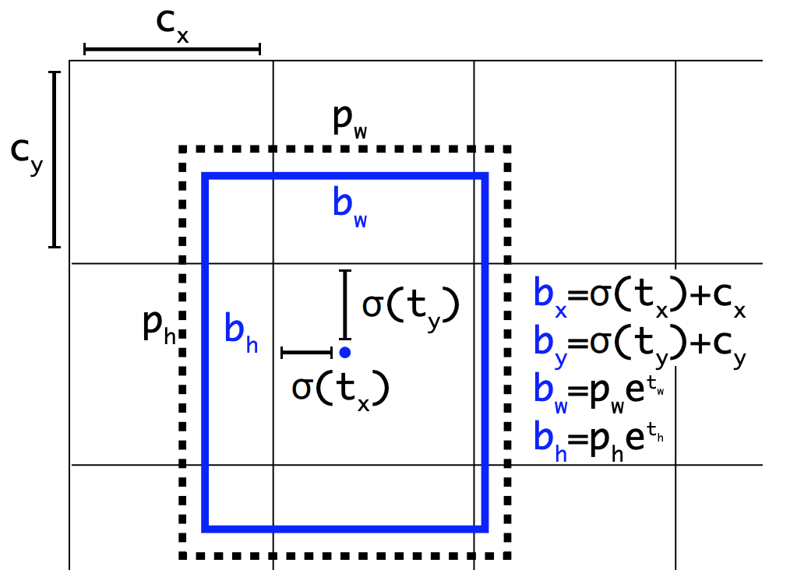

# YOLO9000: Better, Faster, Stronger

이정수

인공지능 오픈랩 팀 IEEE

2021. 02. 20

### [2017 IEEE Conference on Computer Vision and Pattern Recognition (CVPR)](https://ieeexplore.ieee.org/document/8100173)

* ## **Introduction**

  * 기존의 Detection Dataset은 Classification, Tagging Dataset 등 다른 데이터셋에 비해 턱없이 규모가 작음
  * 본 논문에서는 거대한 규모의 Classification Dataset(ImageNet)을 detection에 사용
  * **Hierarchical View Method로 9000↑ Classes를 분류할 수 있었음**

* ## **Better**

  - YOLO v1는 Fast R-CNN보다 **localization error**(예측치와 ground truth의 차이)가 많이 발생

  * Region Proposal Method보다 낮은 Recall(이미지의 object를 빠짐없이 detect하는 정도)

    

  1. Batch Normalization
     
     - 모든 Convolution layer에 BN layer를 추가하여 2% mAP 향상
     
       
     
  2. High Resolution Classifier
     
     * YOLO v1은 224x224로 학습된 VGG모델을 그대로 사용하여 high resolution에 취약했음. YOLO v2에선 input size를 448x448로 늘려 ImageNet에 10 epoch 훈련 후 사용하여 4% mAP 향상
     
       
     
  3. Convolutional With Anchor Boxes

     * YOLO v1에서 Fully Connected Layer를 빼고 Convnet 으로만 계산. bounding box를 직접 regression하는 방법에서 anchor box를 사용하는 방법으로 변경. mAP 69.5%, recall 81% -> mAP 69.2%, recall 88%

       

  4. Dimension Cluster

     * 기존에 Anchor box에 사용되던 보편적인 비율 대신 coco dataset에 K-means clustering을 적용하여 얻은 5가지 anchor box를 사용.  

       

       

  5. Direct location prediction

     * 기존의 Anchor box regression은 x, y좌표를 계산하는데 안정적인 offset값을 학습하는데 시간이 오래 걸리고 불안정함. 아래 식에서 t값의 음양 여부에 따라 박스가 이동

       

     * 이를 left top을 기점으로 얼마나 이동하는지에 대한 식으로 바꿔서 계산. t가  0~1의 범위를 가져 보다 안정적인 학습이 이뤄짐. 5% mAP 향상

       

     

     

  6. Fine-Grained Features

     * YOLO v1에서는 CNN을 통과한 마지막 feature map만 사용하기 때문에 작은 물체에 대한 정보가 사라짐. 이를 상위 레이어의 feature map을 하위 레이어의 feature map에 합쳐주는 passthrough layer를 사용하여 해결. 1% mAP 향상

     

  7. Multi-Scale Training

     * Fully-Connected layer가 없어지며 다양한 size의 input을 입력할 수 있게 됨. 따라서 학습시 {320, 352, ..., 608}중 임의의 size를 10 batch마다 바꿔가며 학습하여 scale-robust한 model 학습 가능

       

  8. 결론

     

* ## Faster

  - YOLO v1에서 사용했던 Googlenet, VGG등의 거대한 백 본 네트워크 대신 직접 구축한 새로운 CNN 네트워크인 Darknet 사용

    

* ## Stronger

  - 훈련에 사용한 detection dataset에는 박스의 좌표정보와 카테고리 수준의 class 정보가 있지만 imagenet dataset에는 보다 세부카테고리에 대한 정보가 많음. 이렇게 데이터셋별로 정보가 상이하기 때문에 일관성있게 통합해주는 과정이 필요

    

  1. Hierarchical Classification

     * 방대한 크기의 class에 대해서 단순히 softmax 계산을 하는것이 아닌, multi-label 개념과 유사하게 계층 방식으로 접근

       ex) imagenet의 "요크셔테리어"와 coco의 "개"는 상호 배타적인 라벨이 아니기 때문에 softmax가 아닌 multi-label로 접근

       * 다만 라벨들이 어느정도 원자성을 띄면 softmax 사용

       

     

  2. Dataset combination with WordTree

     * Tree 구조를 사용하여 COCO dataset, ImageNet dataset을 섞은 계층 구조를 구현

       

  3. Joint classification and detection

     * WordTree를 활용해 총 9418개의 class를 가진 데이터셋을 생성.

     * 이중 9000개의 class가 classification label만 있는 imagenet dataset이기 때문에 실제 학습시엔 COCO dataset을 oversampling하여 4:1의 비율로 학습

     * Classification label만 붙어있는 이미지는 classification loss만 역전파가 되도록 하여 classification과 detection을 한번에 학습

     * 가령 label이 Norfolk terrier일 경우, 트리를 거슬러 올라가며 라벨이 속한 카테고리들을 알 수 있기 때문에 multi-label을 활용한 학습이 가능

       

       

